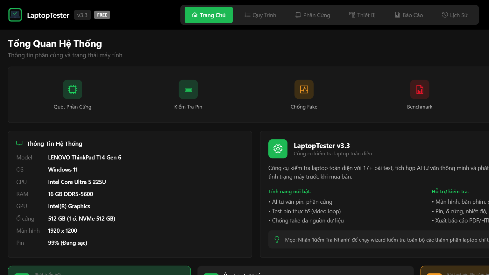
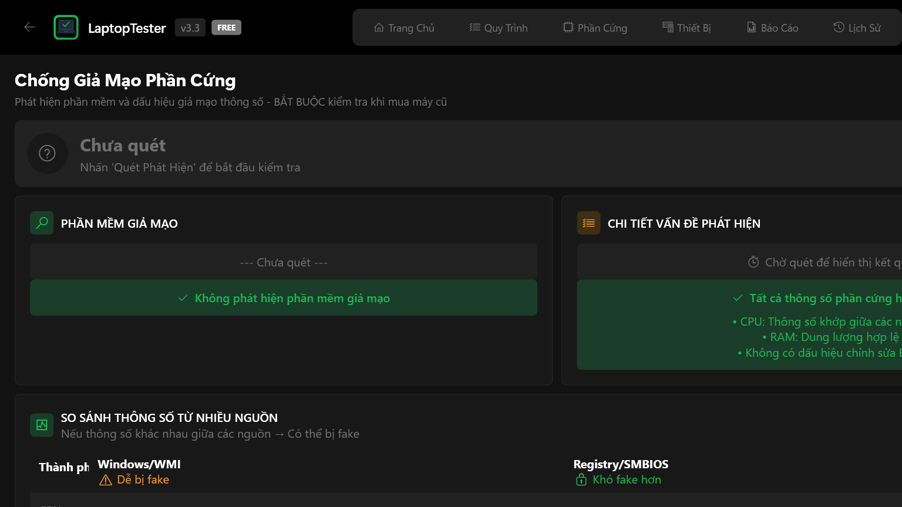
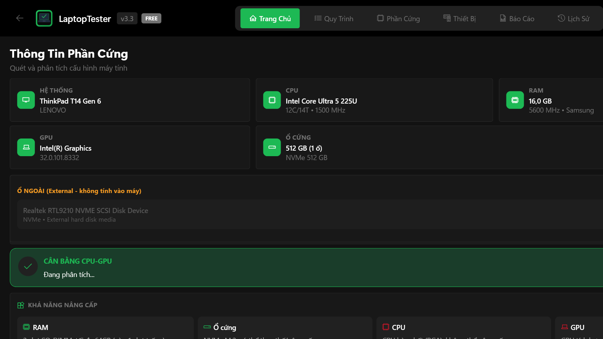
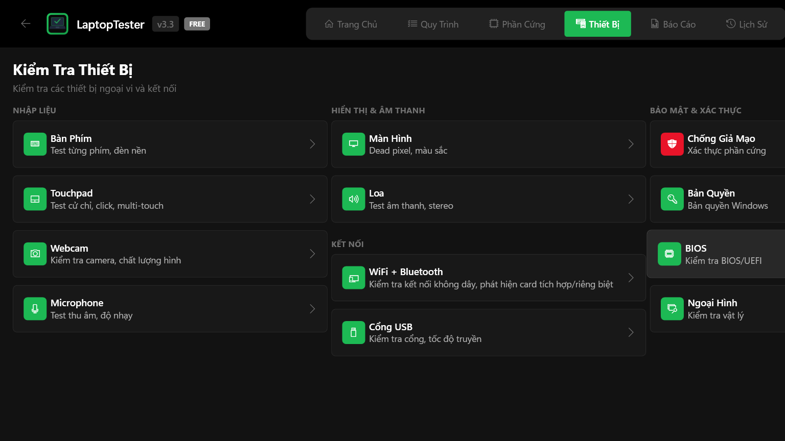

  

<h1 align="center">LaptopTester v3.3.3</h1>

  
  

---

> **[English version below](#english)**

## Giới thiệu

Mình là Lê Văn Ẩn, làm nghề mua bán laptop cũ ở Việt Nam.

Mình viết LaptopTester vì gặp quá nhiều máy bị fake cấu hình. Một lần mua máy được quảng cáo i7 / 16GB RAM / 512GB SSD, mở lên thì System Properties, Task Manager, Dxdiag đều hiện đúng. Nhưng dùng thực tế thì chậm bất thường. Kiểm tra kỹ thì phát hiện RAM thật chỉ 8GB (thông số hiển thị bị sửa qua Registry), ổ cứng là HDD 500GB đặt tên giống SSD.

Những thủ thuật này không phức tạp -- chỉ cần sửa vài giá trị Registry và thay đổi thông số WMI. Người mua mở máy lên, xem Properties, thấy đúng là tin. Kể cả kỹ thuật viên cũng bị qua mặt nếu chỉ kiểm tra bằng một nguồn.

Bản đầu tiên viết bằng Python vào tháng 10/2025, chạy console để so sánh thông số từ WMI, Registry và SMBIOS. Dần dần thêm kiểm tra pin, bàn phím, màn hình, USB... vì mỗi lần mua máy cần kiểm tra nhiều thứ mà không có công cụ nào làm hết.

Sau khoảng 5 tháng, v3.3 được viết lại bằng C# / WPF, giao diện tối Spotify-style, chạy từ USB không cần cài đặt.

Tính năng mình tâm đắc nhất là **Quick Test**. Với nhiều người, khi đi mua laptop cũ, việc nên test cái gì, dùng phần mềm nào, test như thế nào là cả một vấn đề. Quick Test giải quyết chuyện đó -- quy trình 10 bước có hướng dẫn cụ thể: phần cứng, ổ cứng, pin, màn hình, bàn phím, touchpad, loa, micro, camera. Chỉ cần nhấn bắt đầu, làm theo, cuối cùng nhận tổng điểm /100 và đánh giá: "Máy tốt", "Cần cân nhắc" hoặc "Không nên mua".

Phần mềm còn nhiều hạn chế, mình sẽ cải thiện dần.

---

## Tính năng

### Chống giả mạo cấu hình

Truy vấn đồng thời 3 nguồn độc lập, phát hiện sai lệch ngay lập tức:

| Nguồn | Mô tả |
|-------|-------|
| WMI | Nguồn mà System Properties, Task Manager, Dxdiag dùng. Có thể bị sửa bằng phần mềm. |
| Registry | Một số phần mềm fake sửa ở đây để thay đổi hiển thị. |
| SMBIOS / BIOS | Thông số trên firmware phần cứng. Rất khó giả mạo vì nằm ở tầng thấp hơn OS. |

  

### Kiểm tra pin

- Sức khỏe pin (%), so sánh dung lượng thiết kế vs thực tế
- Số chu kỳ sạc, nhà sản xuất pin, điện áp
- Stress test với workload thực tế và đo thời gian xả

  

### Quét phần cứng

- CPU: tên, nhân/luồng, xung nhịp
- RAM: dung lượng, tốc độ, nhà sản xuất
- GPU, ổ cứng (NVMe/SATA/HDD), ổ ngoài
- Đánh giá cân bằng CPU-GPU, khả năng nâng cấp

  

### Thiết bị ngoại vi -- 12 bài test

| Nhập liệu | Hiển thị & Âm thanh | Kết nối |
|---|---|---|
| Bàn phím | Màn hình -- điểm chết, hở sáng | WiFi + Bluetooth |
| Touchpad | Loa -- stereo trái/phải | Cổng USB |
| Webcam | | |
| Microphone | | |

  

### Cổng USB

Phát hiện loại cổng (USB 2.0/3.0/3.1/USB-C/Thunderbolt 4), tốc độ, vị trí, công suất sạc PD.

  

### Khác

- Nhiệt độ CPU/GPU theo thời gian thực
- Benchmark CPU, GPU, ổ cứng
- AI tư vấn (cần API Key Cloudflare miễn phí)
- Xuất báo cáo HTML/PDF
- Lịch sử test, phím tắt F1-F7
- Song ngữ Việt -- Anh

---

## Tải về

**[Tải LaptopTester v3.3.3](https://github.com/anlvdt/LaptopTester/releases/latest)** -- File .exe (~271 MB), tích hợp runtime, không cần cài đặt, chạy từ USB.

Yêu cầu: Windows 10/11 (64-bit), quyền Administrator.

## Bảng giá

| | Free | Pro (149K, trả một lần) |
|---|---|---|
| Quét phần cứng, thiết bị, pin, nhiệt độ | Có | Có |
| Chống fake đa nguồn | -- | Có |
| Benchmark, AI tư vấn | -- | Có |
| Xuất báo cáo PDF | -- | Có |

Chi tiết: [laptoptester.web.app](https://laptoptester.web.app)

## Phiên bản

| Version | Ghi chú |
|---------|---------|
| v3.3.3 | Patch: fix Settings layout, Shopee Affiliate, license path portable. |
| v3.3.2 | Patch: fix tất cả nút mở URL không hoạt động khi chạy Administrator. |
| v3.3.1 | Patch: fix app chạy background không hiện UI. |
| v3.3 | C# / WPF / .NET 8. Giao diện tối, AI advisor, song ngữ. |
| v2.x | Python (10/2025). Không còn phát triển. |

## Liên hệ

- Facebook: [fb.com/anlvdt](https://www.facebook.com/anlvdt)
- Zalo: 0976896621

---

<h2 id="english">English</h2>

### About

I'm Le Van An, a used laptop dealer in Vietnam.

I built LaptopTester because I kept running into machines with faked specs. Once I bought a machine advertised as i7 / 16GB RAM / 512GB SSD -- System Properties, Task Manager, and Dxdiag all confirmed those numbers. But it was unusually slow. Digging deeper, I found the actual RAM was only 8GB (display values were modified via Registry), and the drive was a 500GB HDD renamed to look like an SSD.

These tricks aren't complicated -- just editing Registry values and altering WMI display data. Buyers check Properties, see matching specs, and trust it. Even technicians get fooled when only checking one source.

The first version was a Python console app in October 2025, cross-checking specs between WMI, Registry and SMBIOS. Over time I added battery, keyboard, display, USB tests -- because every used machine needed checking across many components and no single tool covered everything.

After about 5 months, v3.3 was fully rewritten in C# / WPF with a dark Spotify-style interface, running directly from USB.

My favorite feature is **Quick Test**. For many people buying a used laptop, knowing what to test, which tool to use, and how to do it properly is already a challenge. Quick Test solves that -- a guided 10-step diagnostic covering hardware, storage, battery, display, keyboard, touchpad, speaker, mic, and camera. Just press start, follow the steps, and get a score out of 100 with a clear verdict: "Good", "Consider carefully", or "Don't buy".

The software still has room for improvement. I share it for anyone who finds it useful.

### Download

**[Download LaptopTester v3.3.3](https://github.com/anlvdt/LaptopTester/releases/latest)** -- Single .exe (~271 MB), runtime included, no installation, runs from USB.

Requires: Windows 10/11 (64-bit), Administrator privileges.

### Pricing

| | Free | Pro (149K VND, one-time) |
|---|---|---|
| Hardware scan, device testing, battery, temperature | Yes | Yes |
| Multi-source anti-fake | -- | Yes |
| Benchmark, AI advisor | -- | Yes |
| PDF report export | -- | Yes |

Details: [laptoptester.web.app](https://laptoptester.web.app)

---

## Ủng hộ | Support

  
  
  

  <i>Nếu LaptopTester hữu ích, bạn có thể ủng hộ mình qua Shopee, MoMo hoặc chuyển khoản.</i> 
  <i>If LaptopTester is useful to you, consider supporting via Shopee, MoMo, or bank transfer.</i>

---

  <i>(c) 2026 Le Van An</i>

